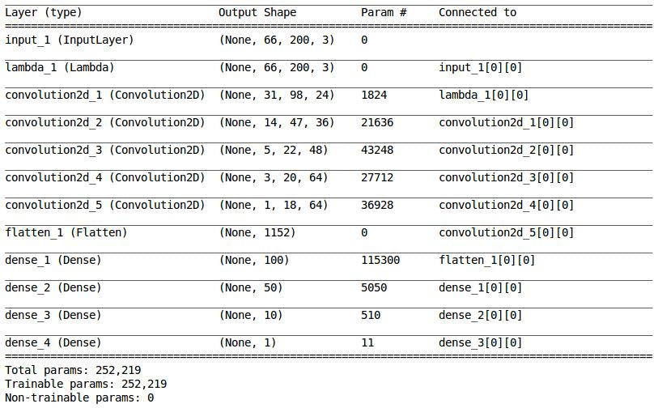
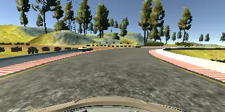
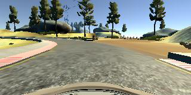
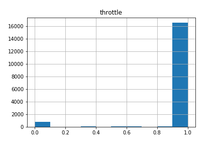
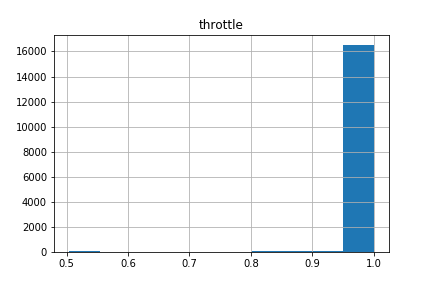
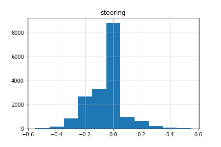
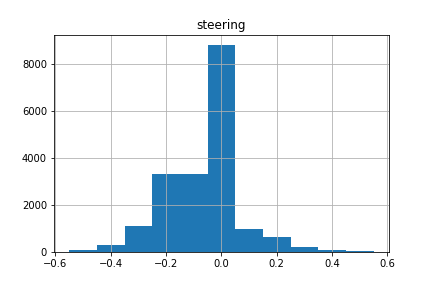
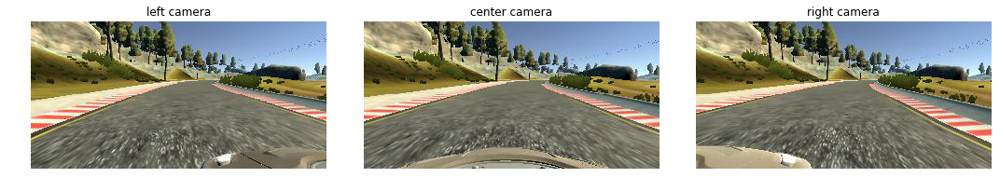

#**Behavioral Cloning** 

**Behavioral Cloning Project**

The goals / steps of this project are the following:
* Use the simulator to collect data of good driving behavior
* Build, a convolution neural network in Keras that predicts steering angles from images
* Train and validate the model with a training and validation set
* Test that the model successfully drives around track one without leaving the road
* Summarize the results with a written report


[//]: # (Image References)

[image1]: ./examples/placeholder.png "Model Visualization"
[image2]: ./examples/placeholder.png "Grayscaling"
[image3]: ./examples/placeholder_small.png "Recovery Image"
[image4]: ./examples/placeholder_small.png "Recovery Image"
[image5]: ./examples/placeholder_small.png "Recovery Image"
[image6]: ./examples/placeholder_small.png "Normal Image"
[image7]: ./examples/placeholder_small.png "Flipped Image"

## Rubric Points
Here I will consider the [rubric points](https://review.udacity.com/#!/rubrics/432/view) individually and describe how I addressed each point in my implementation.  

---
###Files Submitted & Code Quality

####1. Submission includes all required files and can be used to run the simulator in autonomous mode

My project includes the following files:
* model.py containing the script to create and train the model
* drive.py for driving the car in autonomous mode
* model.json containing the convolutional neural network model
* model.h5 containing the trained weights of the convolution neural network 
* writeup_report.md summarizing the results

####2. Submssion includes functional code
Using the Udacity provided simulator and my drive.py file, the car can be driven autonomously around the track by executing 
```sh
python drive.py model.json
```

####3. Submssion code is usable and readable

The model.py file contains the code for training and saving the convolution neural network. The file shows the pipeline I used for training and validating the model, and it contains comments to explain how the code works.

###Model Architecture and Training Strategy

####1. An appropriate model arcthiecture has been employed

My model is based on Nvidias [best practice model](https://images.nvidia.com/content/tegra/automotive/images/2016/solutions/pdf/end-to-end-dl-using-px.pdf) which I enhanced by dropout. I experimented with various model structures but eventually the Nvidia structure fitted my problem best.

My model consists of a convolution neural network with filters of varying strides (model.py line 85 ff.) and kernel sizes (model.py line 92 ff.) and depths between 24 and 64 (model.py line 78 ff.). The model includes RELU layers to introduce nonlinearity (model.py line 127 ff.).The data is normalized in the model using a Keras lambda layer (code line 126). The detailed model structure is provided in one of the sections below.
   


####2. Attempts to reduce overfitting in the model

* Normalization with Keras lambda layer (model.py line 126)
* Dropout layer after the first convolutional layer (model.py line 128)
* Duplicated images with a resulting steering input of >0.1 by applying flipping and reversing of the steering input in order to prevent overfitting on data with small steering angles (vast majority of test data) (model.py line 190 f.)
* Reshuffling training data after all images have been seen (model.py line 269)
* Random choice of image position (left, center, right) during batch generation (model.py line 273 ff.)
* Flip images and reverse steering angle with a probability of 0.6 during batch generation to prevent overfitting on data biased to the left (as training course takes mostly left turns) (model.py line 290 f.)


Result: The model was tested by running it through the simulator and ensuring that the vehicle could stay on the track.

####3. Model parameter tuning

The model used an adam optimizer, so the learning rate was not tuned manually (model.py line 150).

####4. Appropriate training data

Training data was chosen to keep the vehicle driving on the road. I started with the basic Udacity training data and added additional training data myself by driving with the beta simulator providing smooth steering angles by mouse inputs. In the end I duplicated the data for parts of the track which seemed underrepresented to me. 

For details about how I created the training data, see the next section. 

###Model Architecture and Training Strategy

####1. Solution Design Approach

The overall strategy for deriving a model architecture was initially an experimental one. I started with one convolutional and one fully connected layer and increased the number of layers. However, this model was eventually not able to keep the car on the track for the full round.
Consequently, I looked into existing best practices and created a model similar to the one of the [Nvidia paper](https://images.nvidia.com/content/tegra/automotive/images/2016/solutions/pdf/end-to-end-dl-using-px.pdf).
I thought this model was an appropriate starting point as it has already proven its qualities in the real driving world and therefore could also be suitable to the simulator.

In order to gauge how well my models was working, I split my image and steering angle data into a training and validation set already while experimenting with my own model structure. I found that my first model had a low mean squared error on the training set but a high mean squared error on the validation set. This implied that the model was overfitting. 

In order to prevent overfitting I added a dropout layers. For my final architecture I just kept one of them after the first convolution as this yielded the best results. Furthermore I made the model choosing the image position (left, center, right) randomly during batch generation, while adding a corrector for the steering angle bias of left and right images.

Both testing with my own model structure and with the one inspired by Nvidia, the car was driving around the track quite well in the simulator. However at some spots the car was struggeling. To overcome this challenge I duplicated the data for parts of the track which seemed underrepresented in the dataset to me in order to show these track pieces more often to the model.
Furthermore, I realized, that most of the data had very small steering angles. In order to get a more balanced datastructure, I duplicated images with a resulting steering input of >0.1 by applying flipping and reversing of the steering input in order to prevent overfitting on data with small steering angles.

In the end the car was just touching the curbs at the right turn of the track. In order to prevent this issue which I think was caused due to overfitting on the mostly left turns of the track.

At the end of the process, the vehicle is able to drive autonomously around the track without leaving the road or hitting the curbs at full speed.

####2. Final Model Architecture

The final model architecture (model.py lines 123 ff.) consisted of a convolution neural network with the following layers and layer sizes:



####3. Creation of the Training Set & Training Process

I initially started with the training data provided by Udacity.
Example: 


However, I realized that I needed more training data in order to make suitable prediction with my model. I recorded several own rounds on the training track to capture further good driving behavior. For critical parts in the track (e.g. sections which display unique patterns for a very short section in the track) I created extra data by driving and duplicating the collected data in order to create a balanced datastructure representing all patterns of a track. Overall I thereby ended up with a dataset of 17841 datapoints

Example for crutial area where I created extra data:


In the data preprocessing pipline I removed training data with a throttle of less than 0.5 as the car eventually would drive around the track at full speed (model.py line 19 f.).
Data before:

Data afterwards:


I also realized that there was very little data for strong steering angles.


To address this problem, which might result to a model bias towards choosing low steering angles I duplicated the data for steering angles greater 0.1 by flipping the image and reversing the steering angle (model.py line 22 ff.). Afterwards the data distribution looked like this:


With the creation of extra data I was at a dataset of 18237 datapoints. After a shuffle to randomize the data (model.py line 38 f.), I splitted it into a training and a validation set by a split of 9:1 (model.py line 41 f.). The train set size was 16417, while the validation set size was 1825. The validation set helped determine if the model was over or under fitting.

In order to also address the issue regarding the lack of data for strong steering angles and additionally the lack of recovery data, I decided to not only use the center camera images, but also the left and right. During batch generation they are randomly selected. If a left or right image is chosen, the steering angle is corrected by 0.1 for left and -0.1 for right images in order to achieve movement towards the middle of the track (model.py line 178 ff.). Example of the three image positions for 1 datapoint:



As we also saw looking at the steering angle histograms above, the distribution is biased towards the left. Consequently the model will probably overfit towards left turns. To address this issue I implemented a random image flip with steering angle reversion in the batch generation with a probability of 0.6, to show the model a more balanced representation of left and right turns.
Unflipped image


To capture good driving behavior, I first recorded two laps on track one using center lane driving. Here is an example image of center lane driving:

![alt text][image2]

I then recorded the vehicle recovering from the left side and right sides of the road back to center so that the vehicle would learn to .... These images show what a recovery looks like starting from ... :

![alt text][image3]
![alt text][image4]
![alt text][image5]

Then I repeated this process on track two in order to get more data points.

To augment the data sat, I also flipped images and angles thinking that this would ... For example, here is an image that has then been flipped:

![alt text][image6]
![alt text][image7]

Etc ....

After the collection process, I had X number of data points. I then preprocessed this data by ...


I finally randomly shuffled the data set and put Y% of the data into a validation set. 

I used this training data for training the model. The validation set helped determine if the model was over or under fitting. The ideal number of epochs was Z as evidenced by ... I used an adam optimizer so that manually training the learning rate wasn't necessary.
